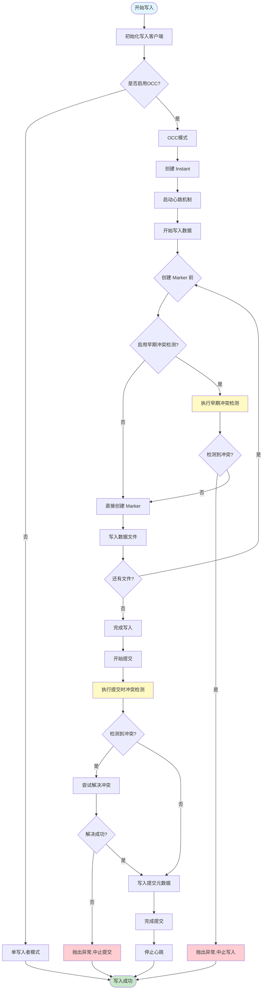
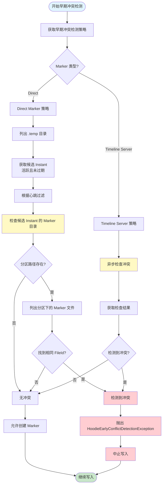
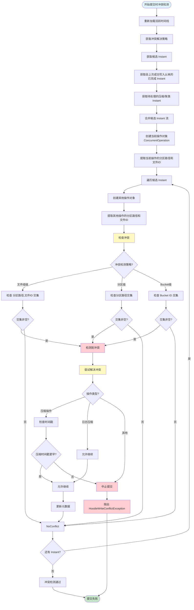
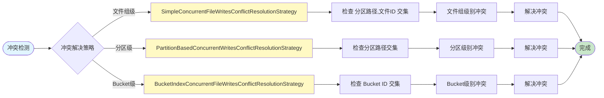
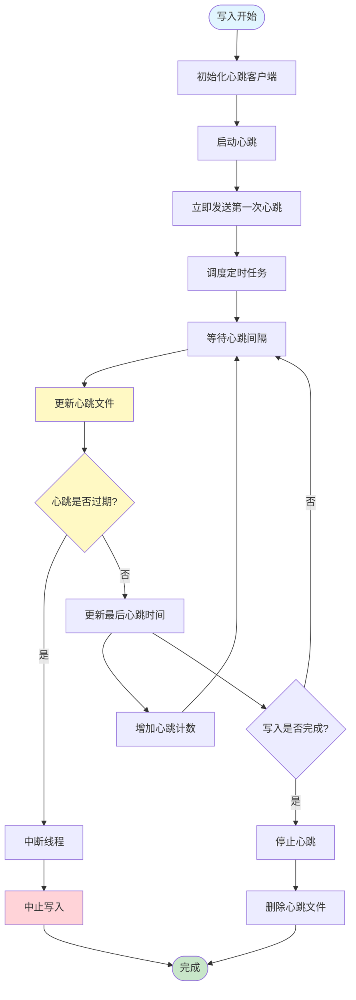
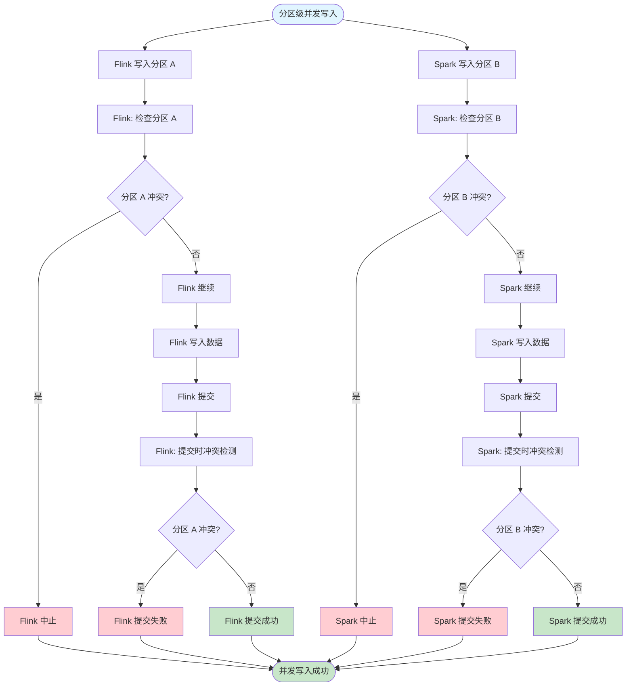
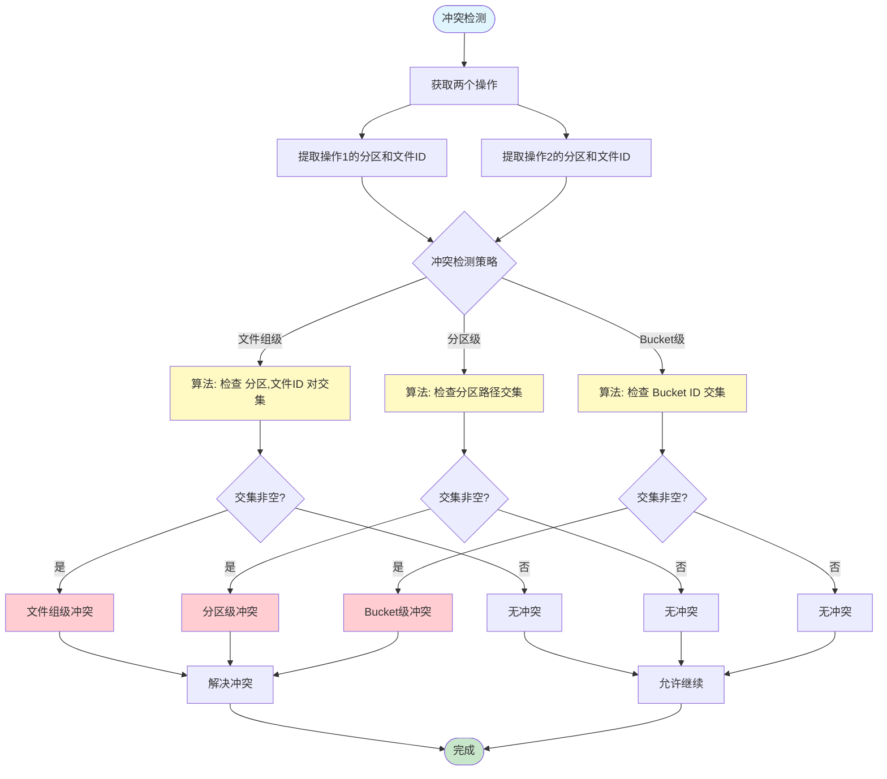

# Hudi OCC 并发控制流程图

## 一、整体写入流程（包含早期冲突检测）

## 二、早期冲突检测详细流程

## 三、提交时冲突检测详细流程

## 四、冲突解决策略对比

## 五、心跳机制流程

## 六、分区级并发控制流程

## 七、冲突检测算法对比

## 图例说明

- 🟦 **蓝色**：流程开始
- 🟩 **绿色**：成功/完成
- 🟥 **红色**：失败/中止
- 🟨 **黄色**：关键检测点

## 关键概念

1. **早期冲突检测**：在写入阶段通过 Marker 机制提前检测冲突
2. **提交时冲突检测**：在提交元数据前进行最终冲突检测
3. **心跳机制**：用于判断写入操作是否仍在进行
4. **冲突解决策略**：可插拔的策略，支持文件组级、分区级、Bucket级

## 使用建议

1. **启用早期冲突检测**：可以提前发现冲突，节省计算资源
2. **合理配置心跳**：根据作业执行时间设置心跳间隔
3. **选择合适策略**：根据业务场景选择文件组级或分区级冲突检测
4. **监控冲突率**：监控写入冲突率，评估并发策略的有效性
