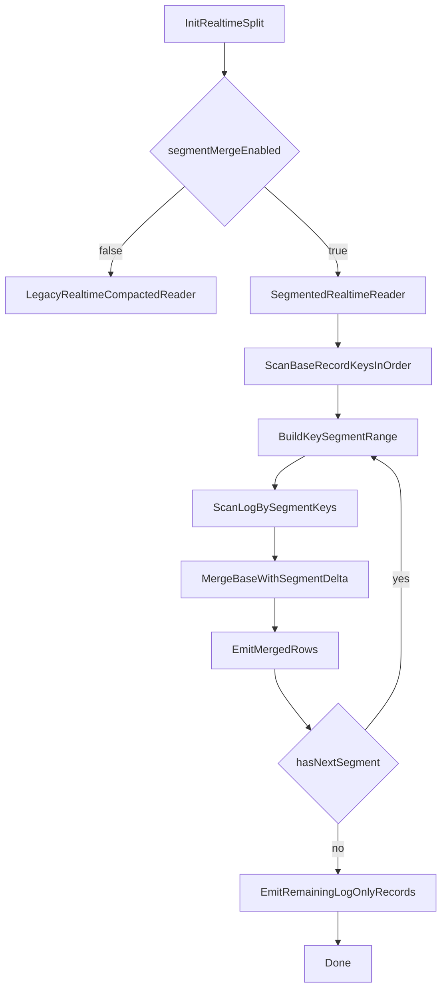

# Hive RT 分段 Merge 详细设计（Opt-in）

## 目标

- 在 Hive MOR realtime 读取路径中，引入“分段外排/流式 merge”新实现，降低 `unique key` 很大场景下的峰值内存。
- 默认不改变现有行为；仅在新开关开启时切换到新路径，确保回滚简单。
- 不修改对外公共 Reader API，尽量把改动收敛在 Hive RT 读链路和 `hudi-common` 内部工具类。

## 现状与问题归因

- 当前 Hive realtime 读主链路会在 reader 初始化时创建并全量扫描 `HoodieMergedLogRecordScanner`，构造完整 `key -> HoodieRecord` 映射。
- 关键入口在 [d:/work/github/hudi/hudi-hadoop-mr/src/main/java/org/apache/hudi/hadoop/realtime/RealtimeCompactedRecordReader.java](d:/work/github/hudi/hudi-hadoop-mr/src/main/java/org/apache/hudi/hadoop/realtime/RealtimeCompactedRecordReader.java) 和 [d:/work/github/hudi/hudi-common/src/main/java/org/apache/hudi/common/table/log/HoodieMergedLogRecordScanner.java](d:/work/github/hudi/hudi-common/src/main/java/org/apache/hudi/common/table/log/HoodieMergedLogRecordScanner.java)。
- 即使有 spill，仍存在 “全量 key working set + 额外 key set + 序列化临时对象” 的峰值；当单 file group 同 commit 的 unique key 很大时易 OOM。

## 设计边界（本次）

- 仅覆盖 Hive MOR realtime merged read 路径：
  - [d:/work/github/hudi/hudi-hadoop-mr/src/main/java/org/apache/hudi/hadoop/realtime/RealtimeCompactedRecordReader.java](d:/work/github/hudi/hudi-hadoop-mr/src/main/java/org/apache/hudi/hadoop/realtime/RealtimeCompactedRecordReader.java)
- 保持默认路径不变：
  - 现有 `HoodieMergedLogRecordScanner + ExternalSpillableMap` 仍可作为 fallback。
- 不要求本次统一改 Spark/Trino。

## 总体方案

- 新增一个可选 reader 路径：`SegmentedRealtimeCompactedRecordReader`（命名可调整），实现“按 key 区间分段处理 + 小窗口 merge”。
- 核心思想：
  - 用 base file 的顺序 key 流（MOR base 文件按 key 有序这一既有假设）驱动分段。
  - log 侧按 segment 过滤读取，仅物化当前 segment 的 key 集，不保存全量 key map。
  - 每个 segment 结束后释放内存，进入下一个 segment。

## 数据流与执行时序

## 关键组件设计

### 1) 新配置与开关

- 在 [d:/work/github/hudi/hudi-hadoop-mr/src/main/java/org/apache/hudi/hadoop/config/HoodieRealtimeConfig.java](d:/work/github/hudi/hudi-hadoop-mr/src/main/java/org/apache/hudi/hadoop/config/HoodieRealtimeConfig.java) 增加：
  - `hoodie.realtime.merge.segmented.enabled`（默认 `false`）
  - `hoodie.realtime.merge.segment.max.keys`（默认如 `200000`）
  - `hoodie.realtime.merge.segment.max.bytes`（默认如 `128MB`）
  - `hoodie.realtime.merge.segment.log.scan.mode`（`FULLKEYS` / `PREFIX`，默认 `FULLKEYS`）
- 在 [d:/work/github/hudi/hudi-hadoop-mr/src/main/java/org/apache/hudi/hadoop/realtime/HoodieRealtimeRecordReader.java](d:/work/github/hudi/hudi-hadoop-mr/src/main/java/org/apache/hudi/hadoop/realtime/HoodieRealtimeRecordReader.java) 按开关选择 legacy 或 segmented reader。

### 2) Segment 构建器（Base 驱动）

- 新增内部类（建议放 `hudi-hadoop-mr/realtime` 包内）：`KeySegmentPlanner`。
- 输入：base record key 顺序迭代器。
- 输出：segment 描述 `{segmentId, minKey, maxKey, keyList(or bloom/prefix hint)}`。
- 规则：
  - 到达 `segment.max.keys` 或 `segment.max.bytes` 即切段。
  - 记录边界 key，供 log 定向扫描。

### 3) Segment Log 扫描器（按段加载）

- 新增 `SegmentedLogDeltaLoader`：
  - 对每个 segment 调用 scanner 的按 key 扫描能力（优先 `scanByFullKeys`）。
  - 仅返回当前 segment 的 `deltaMap`（可继续用 `ExternalSpillableMap` 作为段内结构，但容量远小于全量模式）。
- 尽量复用 [d:/work/github/hudi/hudi-common/src/main/java/org/apache/hudi/common/table/log/AbstractHoodieLogRecordReader.java](d:/work/github/hudi/hudi-common/src/main/java/org/apache/hudi/common/table/log/AbstractHoodieLogRecordReader.java) 现有按 key 过滤路径，避免新增公共 API。

### 4) Segment Merge 执行器

- 新增 `SegmentedMergeExecutor`：
  - 输入：base segment records + `deltaMap(segment)`。
  - 逻辑：与 legacy `mergeRecord` 语义保持一致（删除、preCombine、payload merge 规则一致）。
  - 输出：当前 segment merged 结果。
- 与 legacy 一致复用 merger 语义，避免行为漂移。

### 5) 剩余 log-only 输出

- 在全部 base segment 消费后，输出未命中的 log-only 记录。
- 需要一个轻量“已消费 key”追踪器，建议分段 bitmap/rolling set，避免全局 HashSet 再次放大内存。

## 算法与复杂度

- 现状：近似 `O(U)` 全量 key 常驻（`U` 为 unique keys）。
- 新路径：内存近似 `O(S)`（`S` 为单 segment key 数，`S << U`）。
- 代价：
  - log 文件可能被多次扫描（按 segment），I/O 增加。
  - 用 `segment.max.keys/max.bytes` 在内存与 I/O 间做平衡。

## 兼容性策略

- 新旧两套实现并存，默认 legacy。
- 任何异常（segment scan/merge）可降级回 legacy（可配置是否允许自动降级）。
- 输出语义必须与 legacy 对齐：
  - 相同输入 split 下，结果行集合一致。
  - preCombine/删除标记/字段合并规则一致。

## 可观测性与诊断

- 在 segmented 路径新增指标（日志 + metrics）：
  - `segment_count`
  - `segment_peak_keys`
  - `segment_peak_bytes`
  - `log_rescan_rounds`
  - `segment_merge_time_ms`
  - `fallback_to_legacy_count`
- 关键日志打点位置：reader 初始化、每段开始/结束、降级路径。

## 测试与验收

- 单测（hudi-common + hudi-hadoop-mr）
  - 小数据语义对齐：legacy vs segmented 输出一致。
  - delete/update/insert 混合场景。
  - 空 base / 空 log / log-only 边界。
- 集成测试
  - 构造“大 unique key + 单 split”场景验证不 OOM。
  - 对比 segment 大小参数的内存峰值和查询耗时。
- 验收门槛
  - 峰值内存显著下降（目标：从 `O(U)` 下降到近 `O(S)`）。
  - 查询结果与 legacy 完全一致。

## 分阶段落地

- Phase 1：引入配置开关 + reader 路由框架 + 骨架实现。
- Phase 2：实现 segment planner + segment log scan + merge executor。
- Phase 3：补齐 log-only 输出、metrics、fallback、测试。
- Phase 4：压测调参并形成推荐值。

## 主要改动文件（计划）

- 读链路入口
  - [d:/work/github/hudi/hudi-hadoop-mr/src/main/java/org/apache/hudi/hadoop/realtime/HoodieRealtimeRecordReader.java](d:/work/github/hudi/hudi-hadoop-mr/src/main/java/org/apache/hudi/hadoop/realtime/HoodieRealtimeRecordReader.java)
  - [d:/work/github/hudi/hudi-hadoop-mr/src/main/java/org/apache/hudi/hadoop/realtime/RealtimeCompactedRecordReader.java](d:/work/github/hudi/hudi-hadoop-mr/src/main/java/org/apache/hudi/hadoop/realtime/RealtimeCompactedRecordReader.java)
- 配置
  - [d:/work/github/hudi/hudi-hadoop-mr/src/main/java/org/apache/hudi/hadoop/config/HoodieRealtimeConfig.java](d:/work/github/hudi/hudi-hadoop-mr/src/main/java/org/apache/hudi/hadoop/config/HoodieRealtimeConfig.java)
- 复用点（尽量不改 public API）
  - [d:/work/github/hudi/hudi-common/src/main/java/org/apache/hudi/common/table/log/HoodieMergedLogRecordScanner.java](d:/work/github/hudi/hudi-common/src/main/java/org/apache/hudi/common/table/log/HoodieMergedLogRecordScanner.java)
  - [d:/work/github/hudi/hudi-common/src/main/java/org/apache/hudi/common/table/log/AbstractHoodieLogRecordReader.java](d:/work/github/hudi/hudi-common/src/main/java/org/apache/hudi/common/table/log/AbstractHoodieLogRecordReader.java)

## 风险与缓解

- 风险：segment 太小导致重复扫描开销过高。
  - 缓解：提供 `max.keys/max.bytes` 参数并设保护下限。
- 风险：语义偏差（尤其 delete 和 preCombine）。
  - 缓解：复用 legacy merger，并做逐 split 对比测试。
- 风险：异常路径稳定性。
  - 缓解：新增 fail-open/fail-close 策略，默认 fail-open（降级 legacy）。

